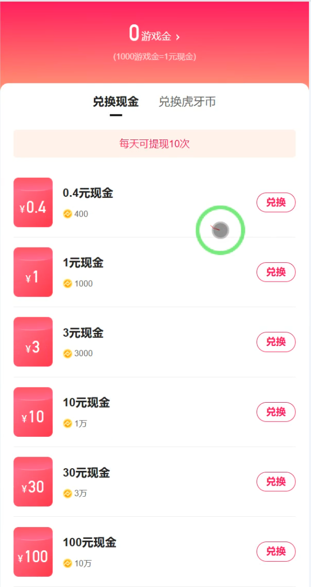
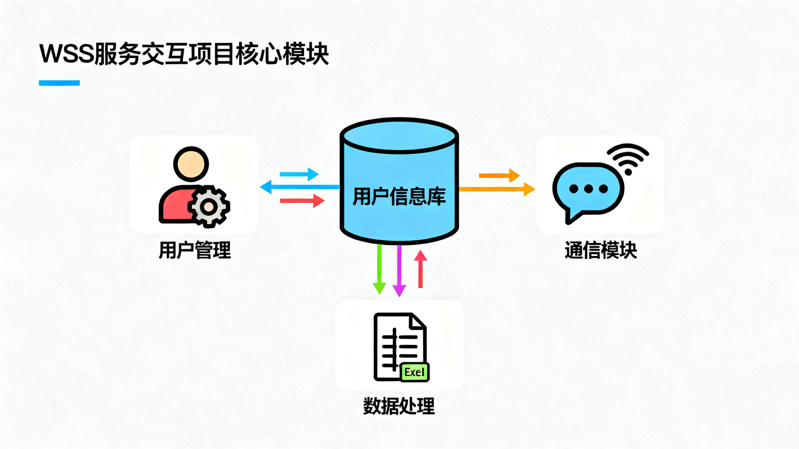
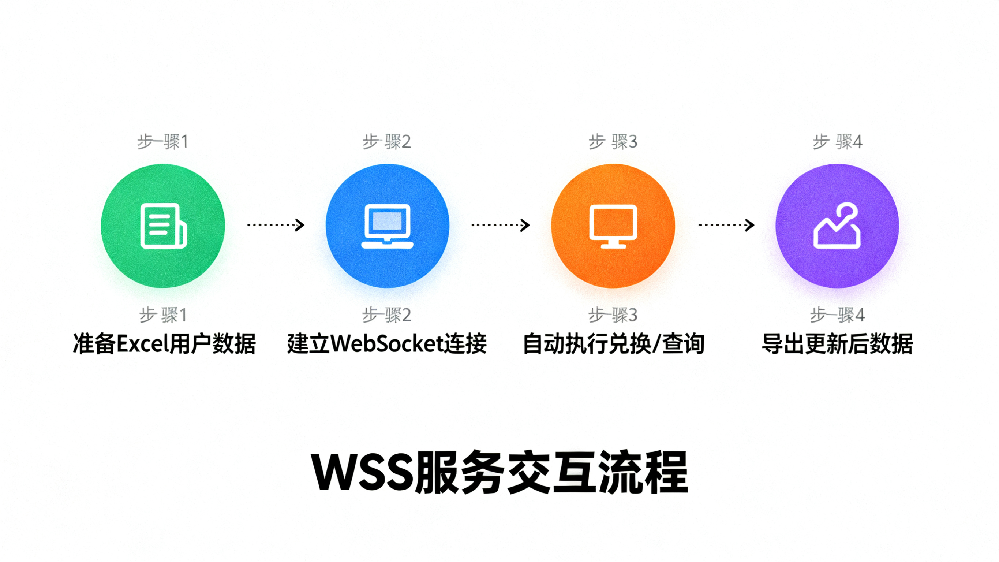
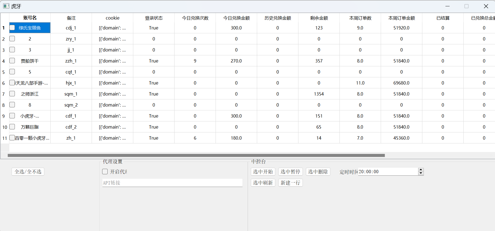

# WSS服务交互项目：WebSocket应用

## 一、项目到底是做什么的？

简单说，这是一个用Python写的程序，能通过网络连接到"WebSocket服务"（一种实时通信服务），帮用户自动做这些事：

- 登录验证账号状态

- 查自己的信息（比如昵称、剩余额度）

- 自动兑换福利（按设置的最低金额找合适的项目）

- 记录消费和兑换历史
  就像一个"自动办事小助手"，不用手动操作，程序会按规则帮你完成这些工作~
  
- 简单看下将会使用程序替代手动操作的页面

  

## 二、核心功能

### 1. 用户管理模块（User类）
  
  → 专门管"用户信息"的小管家

- 记着你的账号ID、登录凭证（Cookie）、代理设置这些基础信息

- 跟踪你是不是登录了、有没有绑定微信、实名认证了没

- 存着你的昵称、能换多少东西、还剩多少额度、花了多少钱这些记录

- 帮你处理时间相关的事儿（比如算日期、分页看记录）
  
### 2. 通信模块（Wss类）
  
  → 负责"传话"的联络员

- 帮你和WebSocket服务建立连接，保持沟通

- 处理加密信息（用JavaScript帮忙加密，不用担心看不懂）

- 发消息、收消息、解析消息内容，把服务端说的话"翻译"成程序能懂的格式

- 能把数据导出成Excel，也能从Excel读数据（方便你用表格看记录）
  
### 3. 主要能帮你做什么？

- 自动检查登录状态，看账号能不能用

- 刷新你的个人信息和能兑换的项目列表

- 按你设置的最低金额，自动找合适的项目兑换

- 拉取你一段时间内的消费和兑换记录

- 统计一周花了多少钱、消费了几次
  
## 三、技术怎么实现的？（简单说）
  
### 1. 怎么连接网络？

- 用Python的`aiohttp`库实现"同时聊多个天"（异步通信）

- 支持代理连接，就像用"网络中转站"连接服务

- 消息用Base64编码，简单说就是给信息加个"信封"
  
### 2. 怎么同时处理多件事？

- 用`asyncio`库让程序能"一心多用"（比如同时帮多个用户操作）

- 有错误处理机制，就算出问题也会记下来，不会突然崩溃
  
### 3. 数据怎么存和处理？

- 用`pandas`库处理Excel表格，导入导出都方便

- 用`json`格式存数据，就像用标准化的"笔记本"记东西

- 自动解析订单信息，不用手动看一堆文字
  
### 4. 安全稳定吗？

- 有最大尝试次数限制，不会傻乎乎地一直重试

- 超时会自动断开，不会一直等没响应的服务

- 数据复制时用"深拷贝"，避免信息混乱
  
## 四、工作流程：一步一步看程序怎么跑
  
### 1. 连接流程（怎么和服务接上话）

1. 准备好用户信息，建立WebSocket连接

2. 发登录验证消息给服务端

3. 接收服务端的回复，更新用户状态（比如登录成功/失败）

4. 检查是不是登录了、有没有绑定微信这些必要条件

### 2. 兑换流程（怎么自动换东西）

5. 先看看账号状态对不对，能不能兑换

6. 从服务端拿能兑换的项目列表

7. 按你设置的最低金额，挑合适的项目

8. 发送兑换请求，等结果

9. 没成功的话会重试（最多试你设置的次数）

10. 记录兑换结果，更新剩余额度

### 3. 数据怎么导入导出？

11. 从Excel表格读用户信息（比如Cookie）

12. 程序把信息转换成能用的格式

13. 操作完后，更新用户数据

14. 再把最新的数据写回Excel，方便你查看

## 五、怎么用？（简单4步）

15. 准备一个Excel文件，里面写上用户的Cookie信息

16. 用程序的"导入"功能把数据读进来

17. 调用对应的功能（比如兑换、刷新信息）

18. 用"导出"功能把更新后的数据存回Excel

## 六、可以自己调的设置

- 超时时间：多久没响应就断开连接
- 最低兑换限额：只换不低于这个金额的项目
- 最大尝试次数：最多试几次兑换
- 代理地址：用代理的话填这里

## 七、项目附件

  
  
  

---

这个项目主要解决"重复手动操作"的问题，通过程序自动完成和WebSocket服务的交互，适合需要批量处理用户操作、自动兑换的场景。代码用了异步处理，效率比较高，还支持数据的导入导出，方便日常使用~
