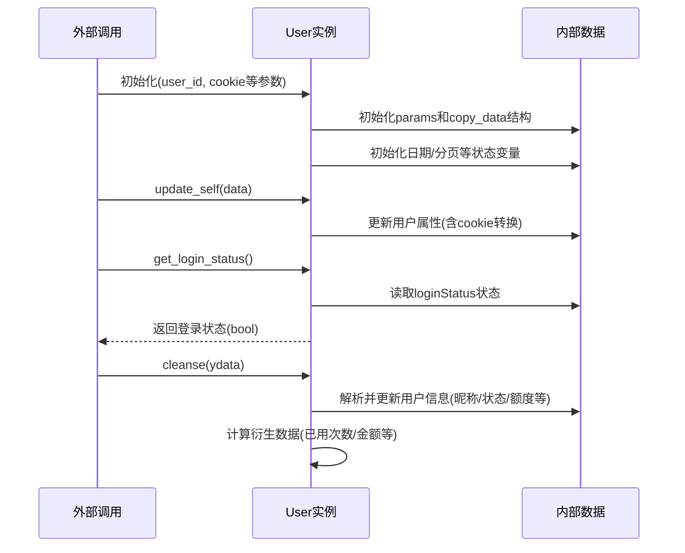
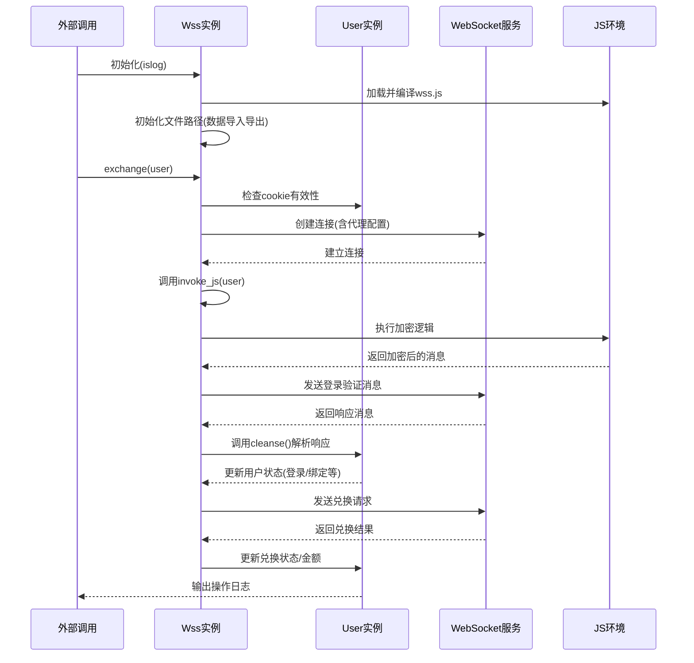
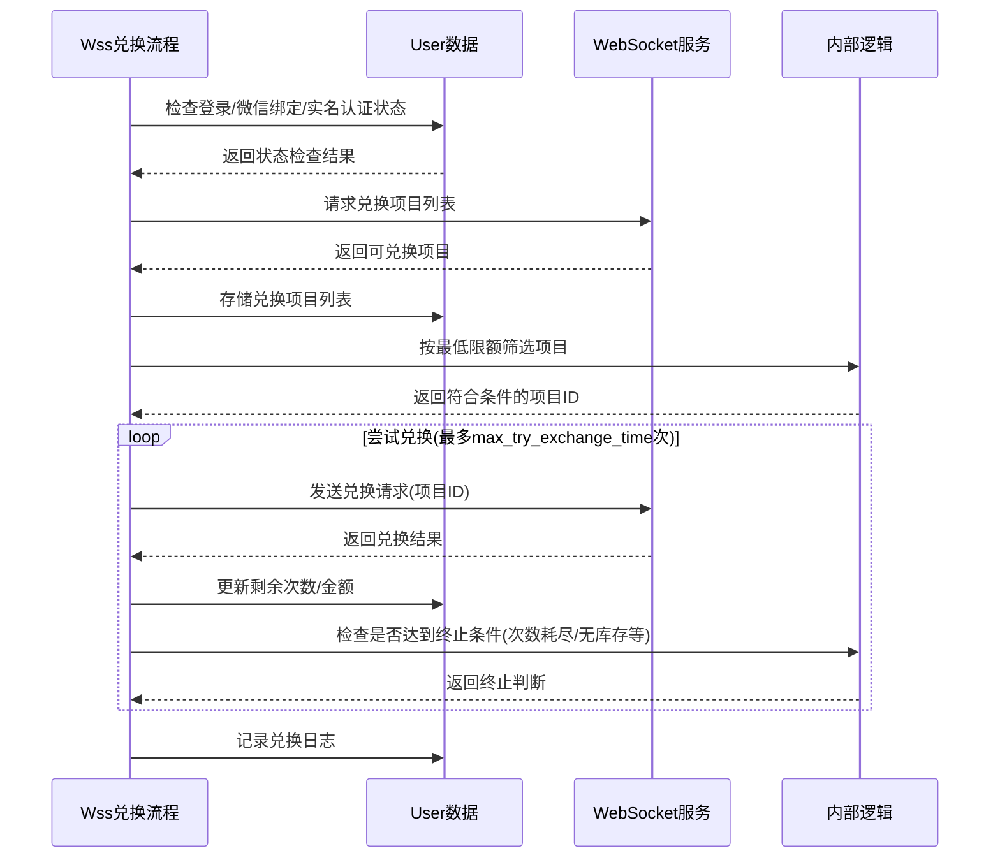
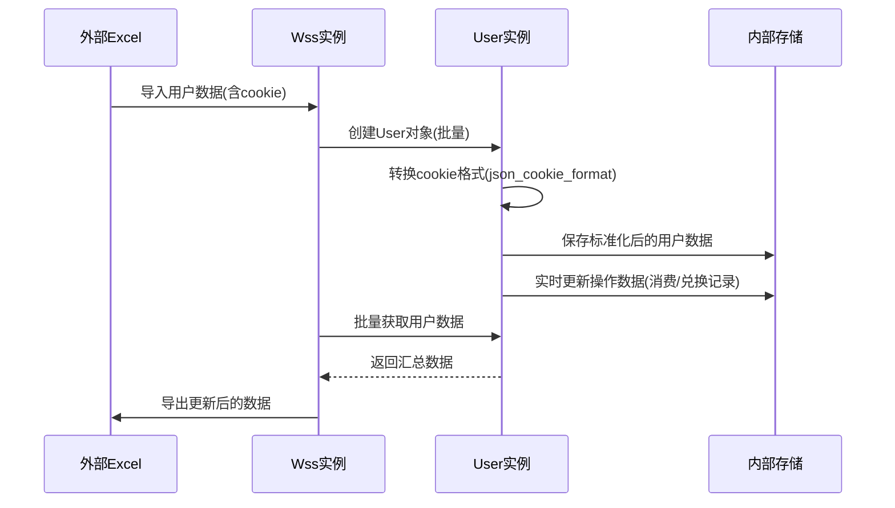

# WSS服务交互项目

## 项目概述

本项目是一个基于WebSocket协议与WSS服务进行交互的Python应用，主要用于处理用户账号的登录状态验证、信息查询、兑换操作及消费记录获取等功能。通过异步网络请求实现高效的多用户并发处理，并支持数据的导入导出管理。

### 1. User类核心交互流程

### 2. Wss类与User类交互流程

### 3. 兑换核心流程交互

### 4. 数据处理交互流程

## 核心功能模块

### 1. 用户管理模块（User类）

- **用户属性管理**：维护用户ID、Cookie、代理设置、超时时间等基础信息

- **状态追踪**：记录登录状态、微信绑定状态、实名认证状态等关键信息

- **数据存储**：保存用户昵称、兑换限额、剩余额度、消费记录等业务数据

- **参数处理**：管理WebSocket通信所需的参数模板及动态更新逻辑

- **日期工具**：提供日期边界计算、分页控制等时间相关功能
  
  ### 2. WSS通信模块（Wss类）

- **WebSocket连接管理**：负责与WSS服务建立和维护连接

- **JS交互**：通过execjs调用外部JavaScript文件处理加密逻辑

- **消息处理**：封装消息发送、接收及解析的核心逻辑

- **错误处理**：实现异步操作的错误捕获与日志记录

- **数据持久化**：提供Excel格式的数据导入导出功能
  
  ### 3. 核心业务功能

- **登录验证**：检查用户Cookie有效性及账号状态

- **信息刷新**：获取用户基本信息、兑换项目列表及重定向URL

- **兑换操作**：根据用户设置的最低限额自动匹配并尝试兑换

- **历史记录**：拉取指定时间段内的消费记录和兑换历史

- **消费统计**：计算一周内的消费总金额和消费次数
  
  ## 技术架构
  
  ### 1. 网络通信

- 基于`aiohttp`实现异步WebSocket通信

- 通过`aiohttp_socks`支持代理连接

- 采用Base64编码处理消息内容
  
  ### 2. 异步处理

- 使用`asyncio`实现异步任务调度

- 采用装饰器模式封装异步错误处理

- 通过`asyncio.gather`实现多用户并发操作
  
  ### 3. 数据处理

- 使用`pandas`处理Excel格式的数据导入导出

- 通过`json`模块处理数据序列化与反序列化

- 采用正则表达式解析订单信息
  
  ### 4. 安全与稳定性

- 设置最大尝试次数防止无限循环

- 实现超时控制避免长时间无响应

- 采用深拷贝避免数据引用冲突
  
  ## 关键流程设计
  
  ### 1. 连接流程
1. 初始化用户参数及WebSocket连接

2. 发送登录验证命令序列

3. 处理服务端响应并更新用户状态

4. 验证登录状态、微信绑定及实名认证
   
   ### 2. 兑换流程

5. 获取可兑换项目列表并按金额排序

6. 根据最低限额筛选合适的兑换项目

7. 发送兑换请求并处理结果

8. 循环尝试直至达到最大次数或兑换条件不满足
   
   ### 3. 数据同步流程

9. 从Excel文件读取用户数据

10. 转换Cookie格式为系统兼容格式

11. 执行相关业务操作后更新用户数据

12. 将更新后的数据写回Excel文件
    
    ## 配置与扩展
    
    ### 1. 可配置参数
- 超时时间（overtime）：控制连接超时阈值

- 最低兑换限额（lowest）：设置可接受的最低兑换金额

- 最大尝试次数（max_try_exchange_time）：限制兑换操作的最大尝试次数

- 代理URL（proxy_url）：配置网络代理
  
  ### 2. 扩展点

- 可通过修改`module`字典扩展支持的命令类型

- 可调整`amount_mapping`扩展兑换金额档位

- 可通过修改`url`参数切换不同的WSS服务端点
  
  ## 使用说明
1. 准备包含用户Cookie信息的Excel文件
2. 通过`impor`方法导入用户数据
3. 调用相应方法执行操作（exchange/refresh/wheel等）
4. 通过`expor`方法保存更新后的数据
