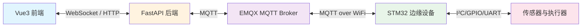
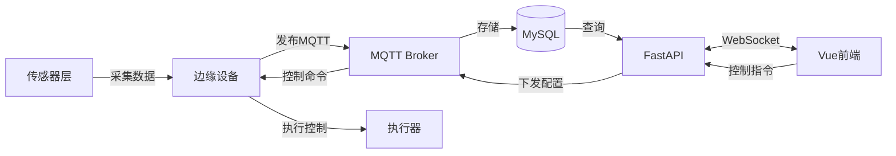
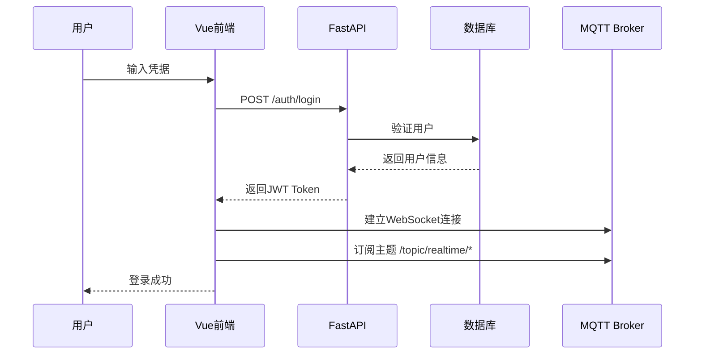
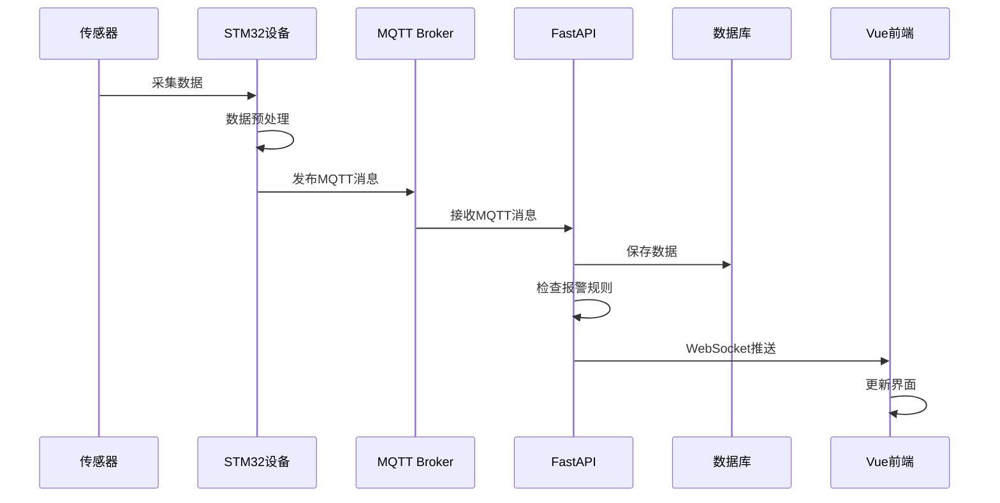
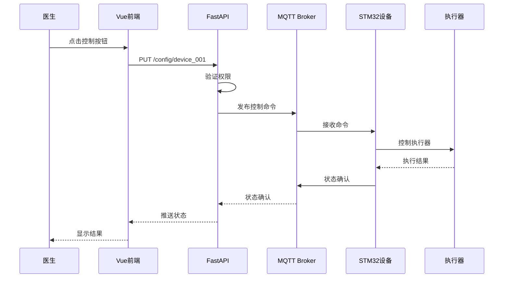
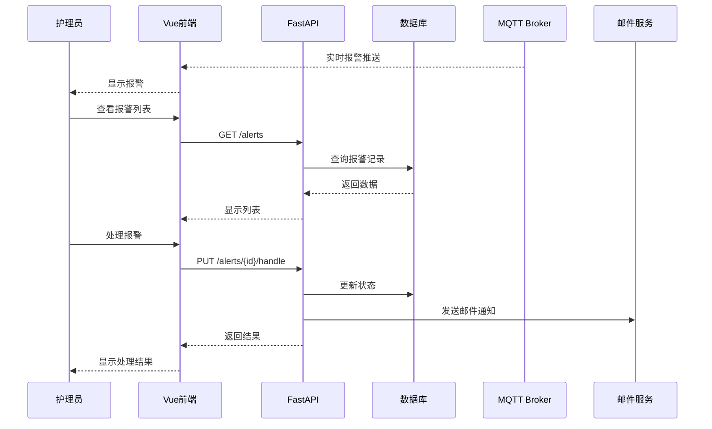
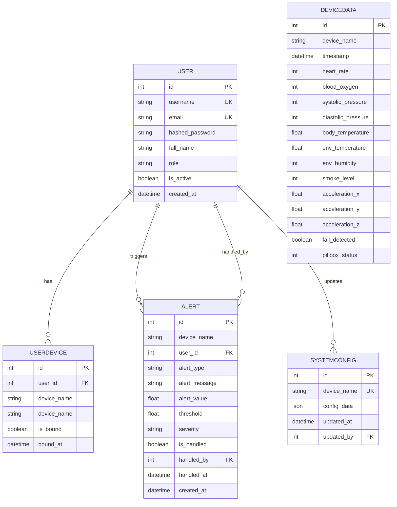

# 物联网疗养系统的核心流程图、时序图、 ER 图（实体关系图）

---

## ✅ 1. 系统架构图（Mermaid）

---

## ✅ 2. 数据流程图（Mermaid）

---

## ✅ 3. 用户登录时序图（Mermaid）

---

## ✅ 4. 实时数据采集与推送时序图

---

## ✅ 5. 设备控制时序图

---

## ✅ 6. 报警处理时序图

---

## ✅ 7. ER 图（实体关系图）

